# AcunMedya Steller Portfolio Website

This project aims to develop a dynamic portfolio website using the ASP.Net MVC framework. Users can manage their portfolios dynamically through this site. The project manages database operations using the Entity Framework Db First approach. Below is a summary of the key topics and structures featured in the project:

## Key Topics and Structures

### 1. ASP.Net MVC Framework:

ASP.Net MVC is a framework built on the Model-View-Controller (MVC) design pattern. In this project, the MVC architecture is used to ensure the code is organized and manageable.

### 2. Entity Framework Db First Approach:
Entity Framework is an ORM technology that acts as a bridge between the database and application code. In this project, the Db First approach is used to generate models from an existing database.

### 3. MVC Architecture:
The MVC architecture separates an application's business logic, user interface, and user interactions into distinct layers. This structure makes the application more modular and testable.

### 4. LINQ Queries:
LINQ (Language Integrated Query) is used for querying data in .NET, making database operations more readable and concise.

### 5. CRUD Operations:
The project provides the necessary infrastructure to perform basic CRUD (Create, Read, Update, Delete) operations on the database.

### 6. Authentication and Authorization:
To develop a secure web application, user authentication and authorization mechanisms have been implemented.

  
## How to Run

To get the project up and running, follow these steps:

    1. Copy the project files to your local machine.
    2. Open the project using an IDE like Visual Studio or Visual Studio Code.
    3. Run the project.
    4. Open your browser and go to https://localhost:port to view the application.

    

  
## Screenshots
Here are some screenshots of the project:

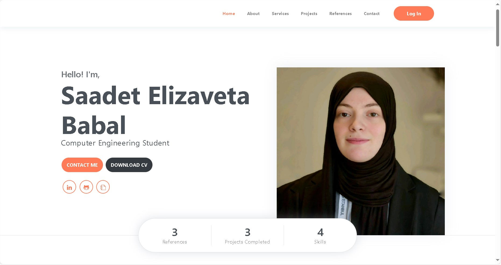

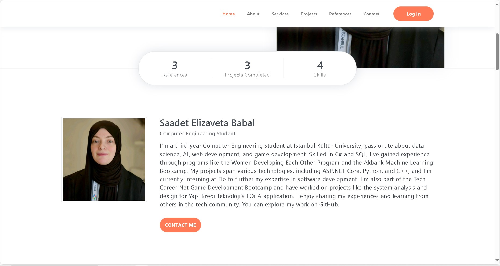

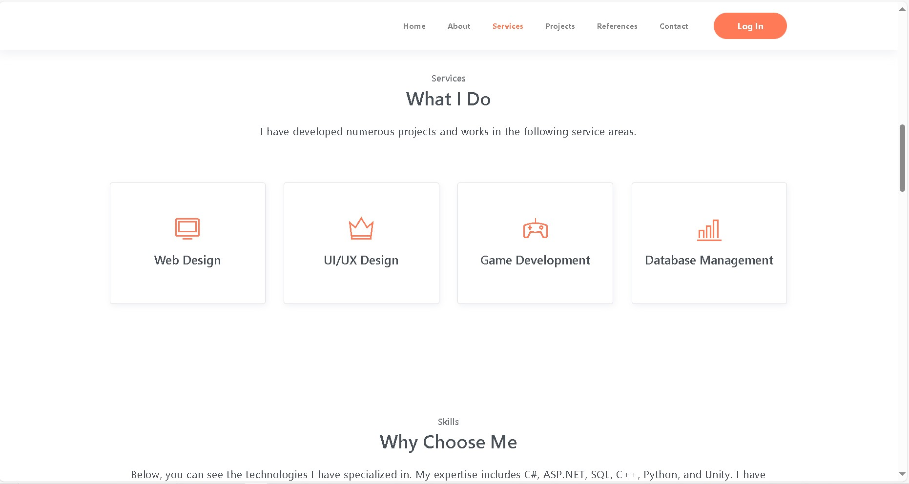

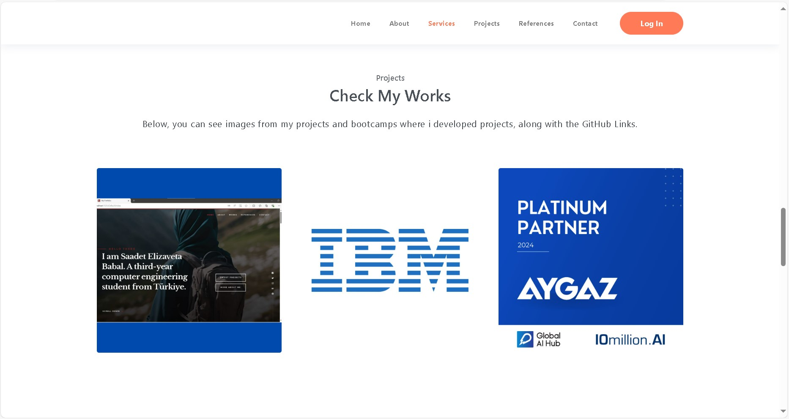

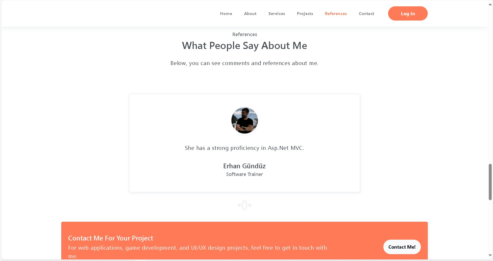

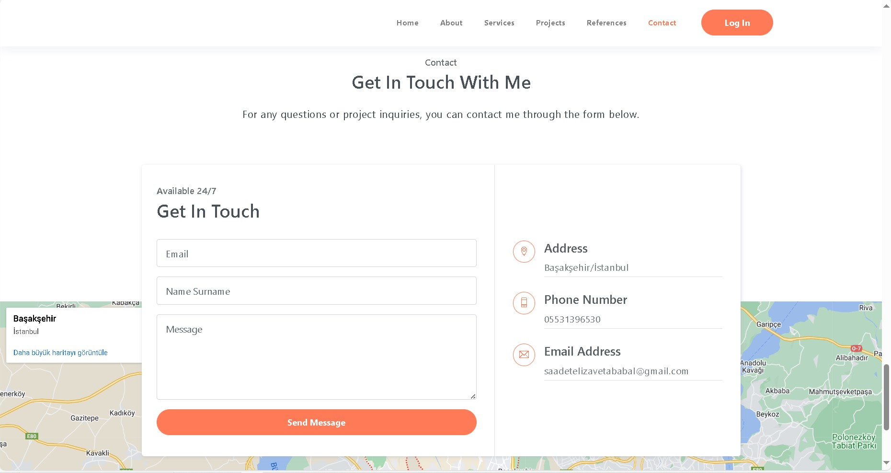

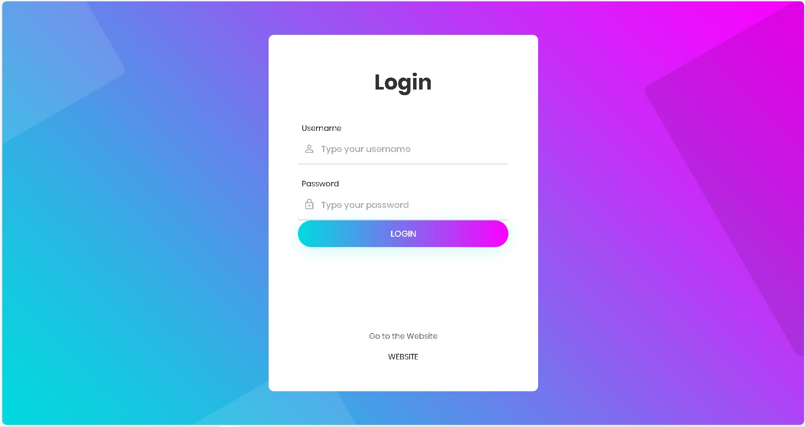

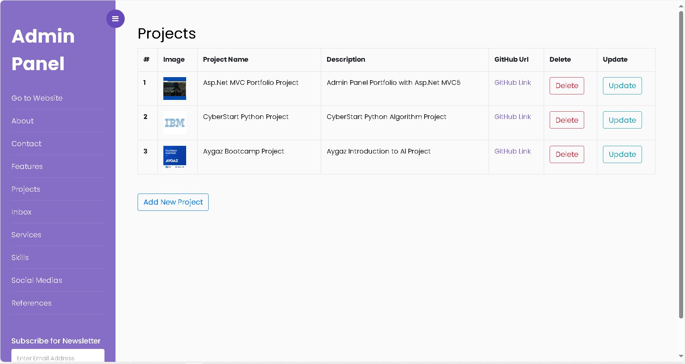

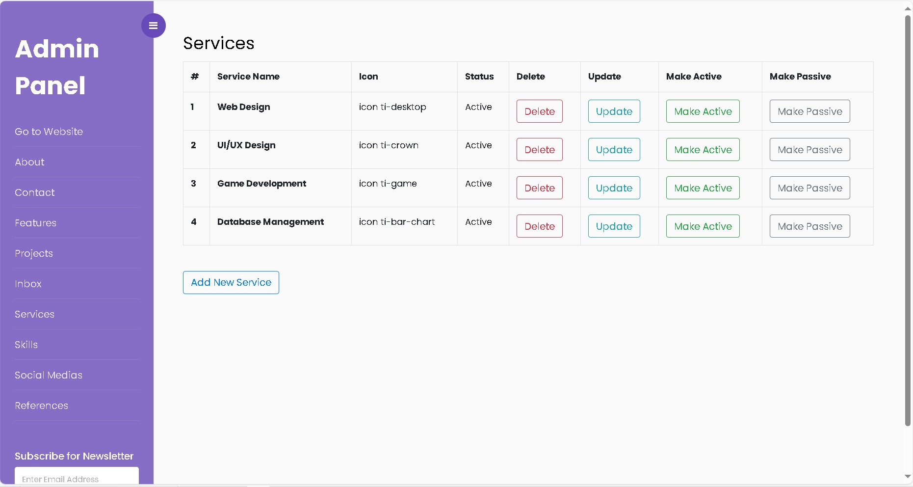

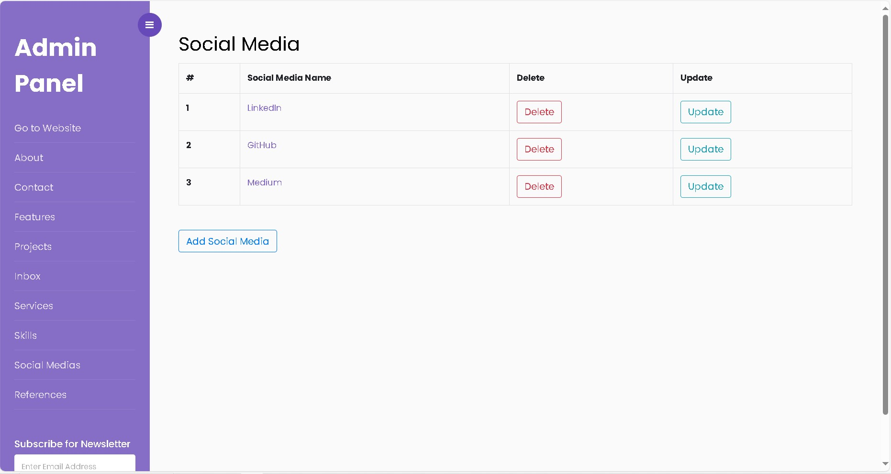

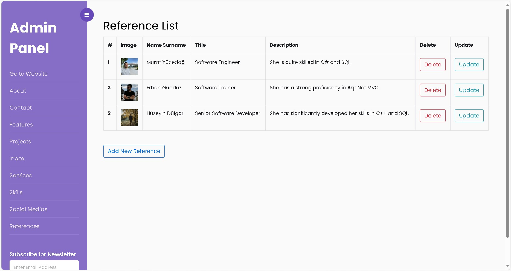

  
